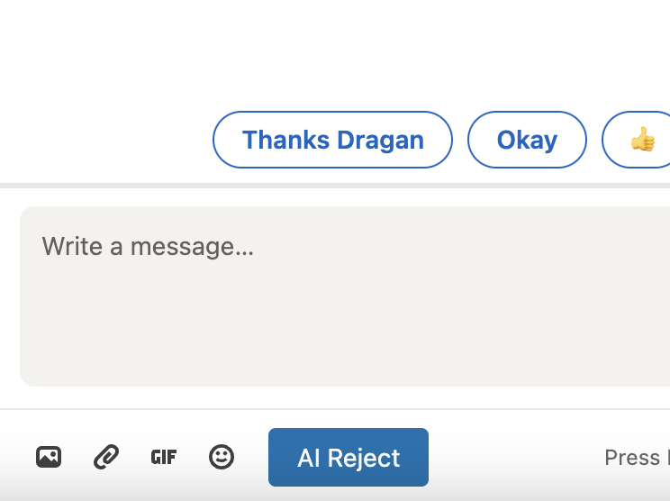

# LinkedIn AI Assistant
A Chrome extension that helps you automatically generate polite rejection messages for LinkedIn conversations using OpenAI's GPT model.

## Preview

## Features
- 🤖 AI-powered response generation
- 💬 Context-aware messages that match the sender's tone
- 🔒 Secure API key storage
- 🎨 LinkedIn-styled UI integration
- ⚡ Quick and easy to use

## Installation
1. Clone this repository
2. Open Chrome and navigate to `chrome://extensions/`
3. Enable "Developer mode" in the top right
4. Click "Load unpacked" and select the extension directory

## Usage
1. Open any LinkedIn conversation
2. Click the "AI Reject" button in the message toolbar
3. First time: Enter your OpenAI API key when prompted
4. The extension will generate a polite rejection message based on the conversation context

## Configuration
- The extension requires an OpenAI API key
- API key is securely stored in Chrome's storage
- You can update your API key by removing the extension and reinstalling it

## Video Tutorials
### How to Build the Extension

### Code Explanation

## Technical Details
- Uses OpenAI's GPT-4 model for response generation
- Built with vanilla JavaScript
- Implements Chrome's Storage API for secure key management
- MutationObserver for dynamic button injection

## Privacy & Security
- Your OpenAI API key is stored securely in Chrome's storage
- No conversation data is stored or logged
- All API calls are made directly to OpenAI's servers
- The extension only activates on LinkedIn.com